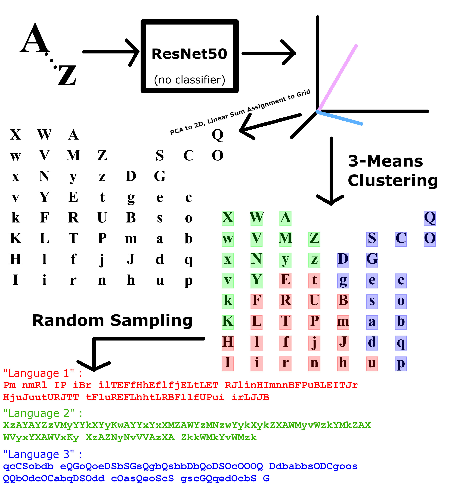

# DeepArrange
A machine learning project that utilizes Microsoft's ResNet-50 deep image recognition algorithm to arrange images onto a grid by visual similarity. Inspired by reddit user "sp-tron" from [their post](https://www.reddit.com/r/dataisbeautiful/comments/e4msqj/emojis_arranged_by_visual_similarity_according_to/) on r/dataisbeautiful.

# The Workflow

## Letter Image Generation

First, the unicode characters are generated in Times New Roman font. This is done by creating `matplotlib` plots that contain only an `AnnotationBbox` containing a `TextArea` with each letter and saving each of those plots to an image with a DPI resulting in a resolution of 224x224 (the resolution required for ResNet50 analysis). Then, As a means of saving these files in a more dataset-scalable fashion, I store them as NumPy matrices in `h5` format. This gives me the liberty to delete the "letters" folder that contains the original images in order to cut down on potentially large storage if I so choose.

## Letter Image Arrangement

Next, I unpack the `h5` file into NumPy matrices for mathematical analysis. I also import the ResNet50 model through Keras' `Applications` utility. However, I remove the final layer of this model that _classifies_ a 2048-dimensional vector into one of 1000 image classes. That way, I preserve the "deciding vectors" (as it were) that ResNet50 uses to classify so that I can use them for my own analysis. So now, the output of my modified ResNet50 algorithm simply spits out a 2048-dimensional vector on every image. I preprocess every letter image for use with ResNet and then save each of their resulting high-dimensional vectors.
Because I wish to arrange each of these vectors onto a _two_-dimensional grid, I use PCA (Principle Component Analysis) to "flatten" the vectors onto a plane that best preserves the variance relationships between each of the vectors. I use SKLearn's `PCA` function for this. Now that I have each vector on a two-dimensional plane, I must arrange them into grid positions. To do this, I use SciPy's Linear Sum Assignment solver to assign each vector to a position on the grid that minimizes the distance that it must move from its original PCA-assigned position (minimizes "cost"). I then plot each vector's corresponding letter image on the grid to view the arrangement in MatPlotLib using `OffsetImage`s.

## Letter Image Clustering

To separate each of these letters into three "classes of letters" by visual similarity, I go back to the 2048-dimensional vectors that ResNet50 gave us. I want to cluster on these vectors instead of on the two-dimensional projections because a lot of spatial information is lost through PCA, so my clusters would be less true to ResNet50's interpretation. I apply SKLearn's K-Means clustering to classify each of these high-dimensional vectors into three classes. Then, not similarly our original arrangement plot, I re-plot the letter images and plot over them an semi-transparent empty `TextArea` whose color corresponds to their class.
Finally, I generate "pseudo-sentences" using each of these letter systems for the sole purpose of driving home the point about how these letter classes do look different from one another when compared side-by-side. This is done by randomly sampling from each class for 99-long "sentences."
